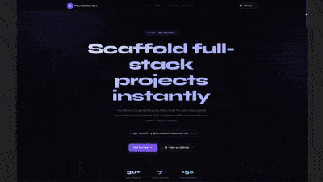
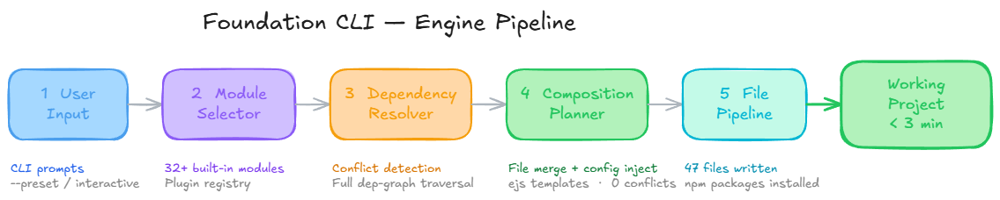
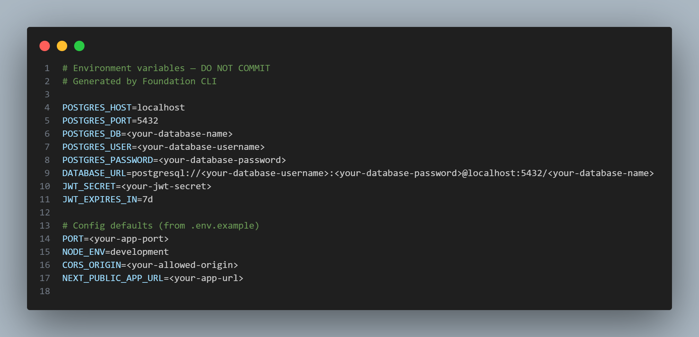
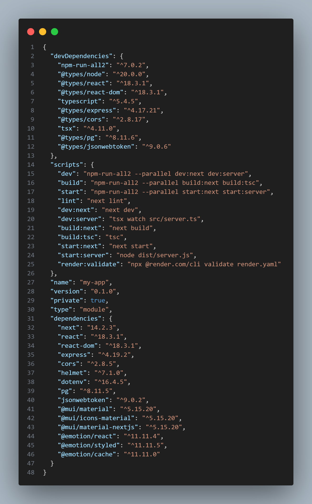
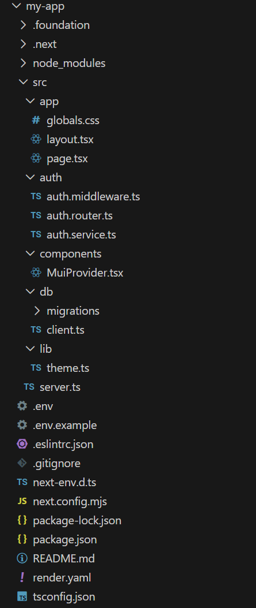
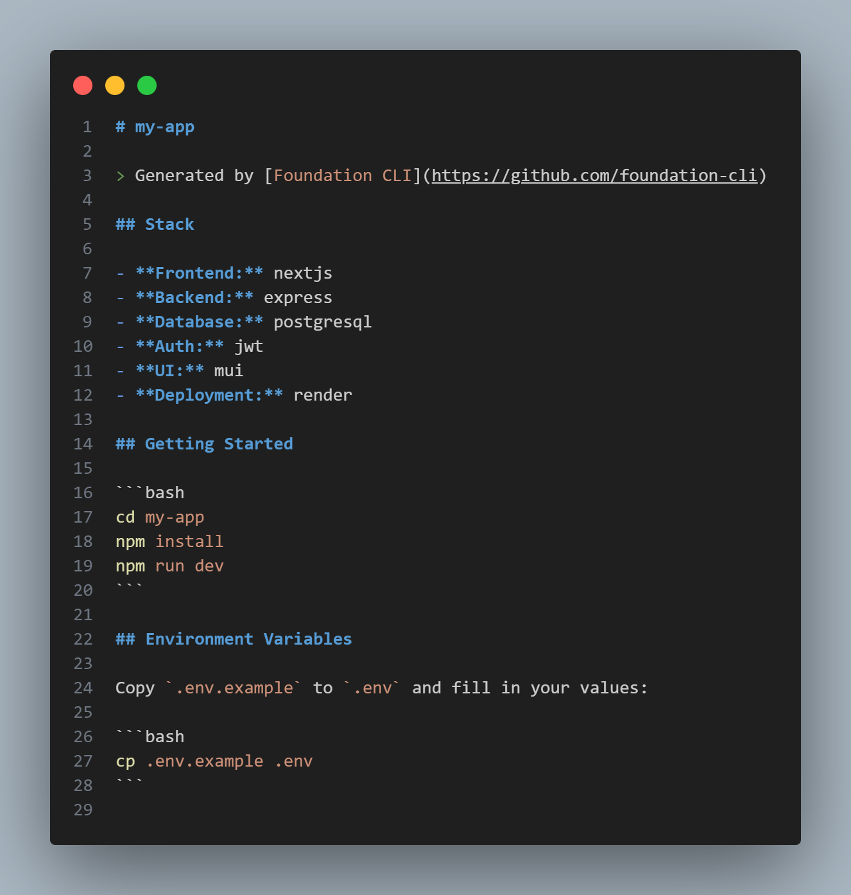
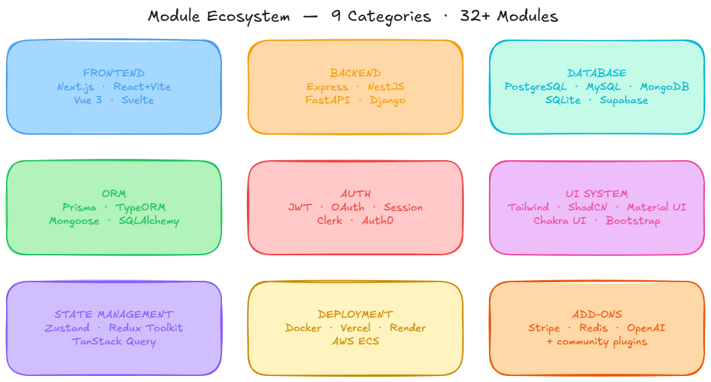
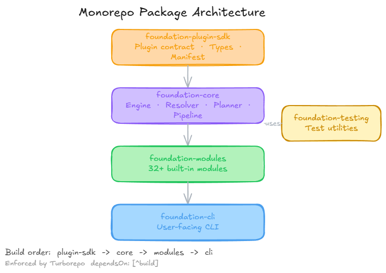

# Foundation CLI

> **A modular project composition engine with a plugin ecosystem.**

[](https://www.npmjs.com/package/@systemlabs/foundation-cli)
[](./LICENSE)
[](https://github.com/ronak-create/Foundation-Cli/actions)
[](https://pnpm.io/)
[](https://www.typescriptlang.org/)

```bash
npx @systemlabs/foundation-cli create my-app
```

A senior developer should be able to go from zero to a running, linted, type-checked, database-connected app with auth in **under 3 minutes** — no manual config editing, no missing dependencies, no broken imports.

---

  [](./public/demo.mp4)

## What is this?

Foundation CLI is a **dependency-aware project assembler**. You describe your intent — *"I want a SaaS with Next.js, Express, PostgreSQL, and JWT auth"* — and the engine resolves the full dependency graph, merges configurations without conflicts, injects integration code, and produces a working project.

**It is NOT:**
- A static template copier (like `create-next-app` or `degit`)
- A code scaffolding tool (like Yeoman or Hygen)
- A monorepo manager (like Nx or Turborepo) — though it can generate one
- A deployment tool — it generates deployment config, not deploy artifacts

---

## Why Foundation CLI?
 
| Feature | Foundation CLI | T3 Stack | create-next-app |
|---|---|---|---|
| Stack flexibility | Any combo (4 frontends, 4 backends, 5 DBs, 5 auth...) | Opinionated (Next.js + tRPC + Prisma only) | Next.js only |
| Conflict detection | ✅ DAG-based resolver blocks incompatible modules | ❌ Fixed stack, no conflicts possible | ❌ No modules to conflict |
| Existing project support | ✅ `foundation add stripe/redis/openai` | ❌ Init only | ❌ Init only |
| Config merging | ✅ Deep merge: package.json, tsconfig, .env, docker-compose | ❌ Static copy | ❌ Static copy |
| Atomic writes | ✅ Stage → commit, full rollback on failure | ❌ No rollback | ❌ No rollback |
---

## How it works


---

## 🚧 Status

> Early-stage project — actively evolving

### ✅ What works
- Project generation (end-to-end)
- Module resolution (frontend + backend + DB)
- Presets (SaaS, AI app, API backend)
- Code generation (models, CRUD)

### ⚠️ Not production-ready yet
- Plugin ecosystem (still stabilizing)
- Some module combinations may have edge-case conflicts

### 🛣️ Roadmap (short-term)
- Improve module compatibility system
- Expand plugin ecosystem
- Better error diagnostics

---

> If you try it and hit issues, please open an issue — feedback directly shapes the project.

---

## Quick start

```bash
# One-shot — no install needed
npx @systemlabs/foundation-cli

# Or install globally
npm install -g @systemlabs/foundation-cli
foundation create my-app
```

### Example session

```
━━━━━━━━━━━━━━━━━━━━━━━━━━━━━━━━━━━━━━━━━━━━━━━━━━━━━━
  FOUNDATION CLI  ·  Build your architecture in minutes
━━━━━━━━━━━━━━━━━━━━━━━━━━━━━━━━━━━━━━━━━━━━━━━━━━━━━━

? Project name › my-saas-app
? What are you building?
❯ SaaS Application       ← loads smart defaults
  AI Application
  E-commerce
  API Backend
  Internal Tool

? Frontend  › Next.js
? Backend   › Express
? Database  › PostgreSQL
? ORM       › Prisma
? Auth      › JWT
? UI        › Tailwind + ShadCN
? Deploy    › Docker

✔ Dependencies resolved   (6 modules, 0 conflicts)
✔ Files staged            (47 files)
✔ npm packages installed  (12s)

🎉 my-saas-app is ready.

  cd my-saas-app && npm run dev
  ▸ Frontend   http://localhost:3000
  ▸ Backend    http://localhost:3001
```

---

## Example Output (Generated Project)

Here’s what Foundation CLI generates out of the box:

### Generated .env



### Generated package.json



### Project Structure



### Generated README



---

## Commands

### Create a project

```bash
foundation create [name]               # interactive
foundation new [name]                  # alias
foundation create my-app --preset saas # non-interactive / CI mode
```

**Available presets:** `saas` · `ai-app` · `ecommerce` · `api-backend` · `internal-tool` · `crm` · `dashboard`

### Module management

```bash
foundation add orm-prisma              # add a built-in module
foundation add stripe                  # add an official add-on
foundation add foundation-plugin-redis # add a community plugin

foundation switch orm prisma           # swap the active ORM
foundation switch backend nestjs       # swap the active backend
foundation switch database mongodb     # swap the database

foundation search <query>              # search the plugin registry on npm
```

### Code generation

```bash
foundation generate model Post         # interactive field prompts → ORM schema
foundation generate crud Post          # model + service + controller + routes
foundation generate --list             # list all available generators
```

### Project inspection

```bash
foundation info                        # stack, modules, ORM, plugins
foundation doctor                      # Node version, env vars, compatibility checks
foundation validate                    # validate project.lock and foundation.config.json
```

### Dev automation

```bash
foundation dev                         # delegates to npm run dev
foundation test                        # delegates to npm run test

foundation db migrate                  # npm run db:migrate / alembic upgrade head
foundation db seed
foundation db reset
foundation db studio                   # Prisma Studio (Prisma only)
foundation db push                     # Prisma db push (Prisma only)
```

### Tooling

```bash
foundation eject [module-id]           # copy module files into your project
foundation upgrade [--dry-run]         # upgrade modules via the lockfile
foundation create-plugin [name]        # scaffold a new plugin package
```

### AI assistant *(requires API key)*

```bash
foundation ai "create a blog with posts, comments, and JWT auth"
# Requires ANTHROPIC_API_KEY or OPENAI_API_KEY
```

---

## Module Ecosystem


## Available modules

See [MODULES.md](./MODULES.md) for the full per-module reference — every file generated, every dependency installed, and the compatibility matrix.

| Category | Options |
|----------|---------|
| **Frontend** | Next.js · React + Vite · Vue 3 · Svelte |
| **Backend** | Express · NestJS · FastAPI · Django |
| **Database** | PostgreSQL · MySQL · MongoDB · SQLite · Supabase |
| **ORM** | Prisma · TypeORM · Mongoose · SQLAlchemy |
| **Auth** | JWT · OAuth · Session · Clerk · Auth0 |
| **UI** | Tailwind CSS · ShadCN/UI · Material UI · Chakra UI · Bootstrap |
| **State** | Zustand · Redux Toolkit · TanStack Query |
| **Deployment** | Docker · Vercel · Render · AWS ECS |
| **Add-ons** | Stripe · Redis · OpenAI · community plugins |

---

## Project archetypes

Start with battle-tested defaults. All selections can be overridden interactively.

| Archetype | Frontend | Backend | Database | Auth | UI | Deploy |
|-----------|----------|---------|----------|------|----|--------|
| `saas` | Next.js | Express | PostgreSQL | JWT | Tailwind | Docker |
| `ai-app` | Next.js | Express | PostgreSQL | JWT | Tailwind | TanStack Query | Docker |
| `ecommerce` | Next.js | Express | PostgreSQL | Session | ShadCN | Zustand | Docker |
| `api-backend` | None | Express | PostgreSQL | JWT | None | Docker |
| `internal-tool` | Next.js | Express | PostgreSQL | JWT | Tailwind | None |
| `crm` | Next.js | NestJS | PostgreSQL | OAuth | MUI | Redux | Docker |
| `dashboard` | Next.js | Express | PostgreSQL | JWT | ShadCN | TanStack Query | Vercel |

---

## Code generation

```bash
foundation generate model Post    # prompts for fields → writes ORM schema
foundation generate crud Post     # model + service + controller + routes
```

Generated output is ORM-aware:

| Active ORM | Model output | CRUD output |
|------------|-------------|-------------|
| Prisma | `prisma/schema.prisma` (model block appended) | `src/services/`, `src/controllers/`, `src/routes/` |
| TypeORM | `src/entities/Post.entity.ts` | Express or NestJS controllers |
| Mongoose | `src/models/Post.model.ts` | Express controllers |
| SQLAlchemy | `src/post.py` | FastAPI router + Pydantic schemas |

All four relation types are supported: `many-to-one`, `one-to-many`, `one-to-one`, `many-to-many`.

---

## Plugin system

Foundation CLI is built to grow through community plugins.

```bash
# Install any community plugin
foundation add foundation-plugin-<name>

# Scaffold a new plugin
foundation create-plugin my-plugin
```

A plugin is a standard npm package with the `foundation-plugin` keyword. Plugin hooks execute in a sandboxed context — they cannot access paths outside `projectRoot`.

**Plugin trust tiers:**

| Tier | Requirements |
|------|-------------|
| Community | Published to npm with `foundation-plugin` keyword |
| Verified | Security audit passed; manifest hash pinned |
| Official | Maintained by the Foundation CLI org |

---

## Monorepo Architecture


## Monorepo packages

| Package | npm | Description |
|---------|-----|-------------|
| `@systemlabs/foundation-cli` | [](https://www.npmjs.com/package/@systemlabs/foundation-cli) | User-facing CLI |
| `@systemlabs/foundation-core` | [](https://www.npmjs.com/package/@systemlabs/foundation-core) | Engine — resolver, planner, pipeline, ORM service |
| `@systemlabs/foundation-modules` | [](https://www.npmjs.com/package/@systemlabs/foundation-modules) | All built-in modules |
| `@systemlabs/foundation-plugin-sdk` | [](https://www.npmjs.com/package/@systemlabs/foundation-plugin-sdk) | Public plugin contract, types, manifest schema |
| `@systemlabs/foundation-testing` | [](https://www.npmjs.com/package/@systemlabs/foundation-testing) | Test utilities for module and plugin authors |

---

## Development

### Prerequisites

- Node.js ≥ 18
- pnpm ≥ 9

### Setup

```bash
git clone https://github.com/ronak-create/Foundation-Cli.git
cd Foundation-Cli
pnpm install
pnpm turbo build
```

### Workflow

```bash
pnpm turbo build       # build all (cached)
pnpm turbo dev         # watch mode
pnpm turbo typecheck   # type-check without emitting
pnpm turbo test        # all tests
pnpm turbo lint        # lint all packages

# Run the CLI locally
node packages/cli/dist/bin.js create
```

### Build order

```
plugin-sdk → core → modules → cli
```

Enforced by turbo `dependsOn: ["^build"]`.

---

## Documentation

| Document | Description |
|----------|-------------|
| [ARCHITECTURE.md](./ARCHITECTURE.md) | Engine internals, data flow diagrams, subsystem contracts, error types |
| [MODULES.md](./MODULES.md) | Per-module reference — files generated, dependencies, compatibility matrix |
| [CONTRIBUTING.md](./CONTRIBUTING.md) | How to contribute — setup, module authoring, testing, commit conventions |

---

## Contributing

Contributions are welcome — bug fixes, new modules, documentation improvements, community plugins. Please read [CONTRIBUTING.md](./CONTRIBUTING.md) before opening a PR.

Found a bug? [Open an issue.](https://github.com/ronak-create/Foundation-Cli/issues/new?template=bug_report.md)  
Have an idea? [Start a discussion.](https://github.com/ronak-create/Foundation-Cli/discussions)

---

## Release notes

Release notes are published on [GitHub Releases](https://github.com/ronak-create/Foundation-Cli/releases). Each release includes a changelog broken into **New features**, **Bug fixes**, **Breaking changes**, and **Contributors**.

---

## Tech stack

| Purpose | Library |
|---------|---------|
| Prompts | `@inquirer/prompts` |
| Terminal colour | `chalk` |
| Spinners | `ora` |
| Templating | `ejs` |
| Schema validation | `ajv` |
| YAML | `js-yaml` |
| Process execution | `execa` |
| Build | `tsup` |
| Tests | `vitest` |
| Monorepo | `pnpm` + `turbo` |

---

## Featured

<a href="https://forg.to/products/foundation-cli" target="_blank" rel="noopener">
  
</a>

## License

MIT — see [LICENSE](./LICENSE) for details.

---

*Foundation CLI — Designed for longevity. Built for scale.*